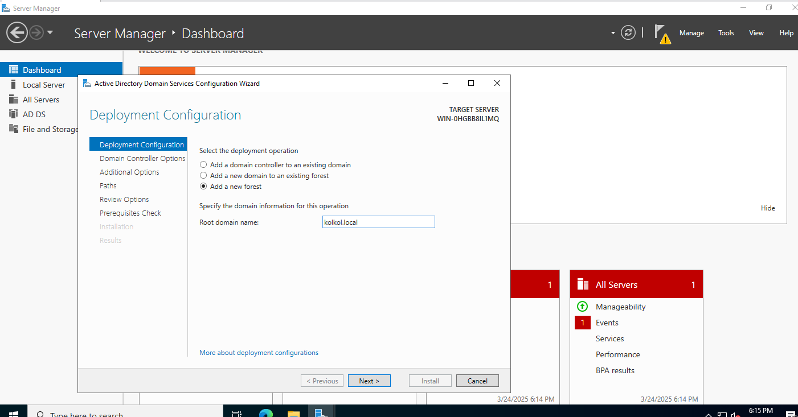
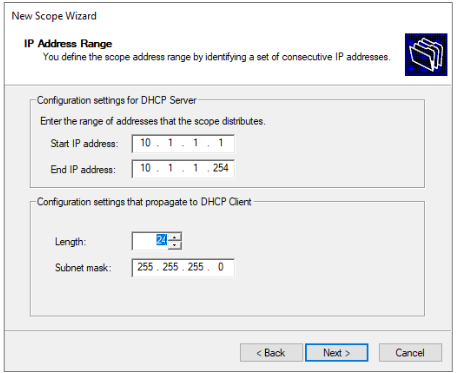
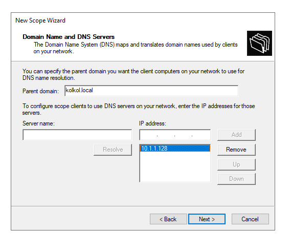
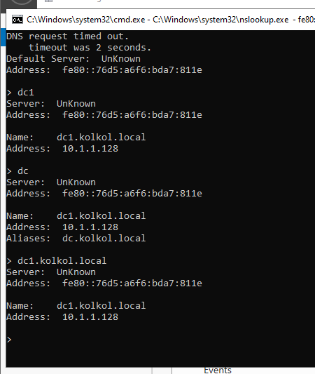
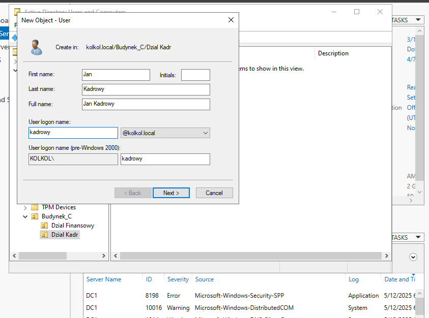
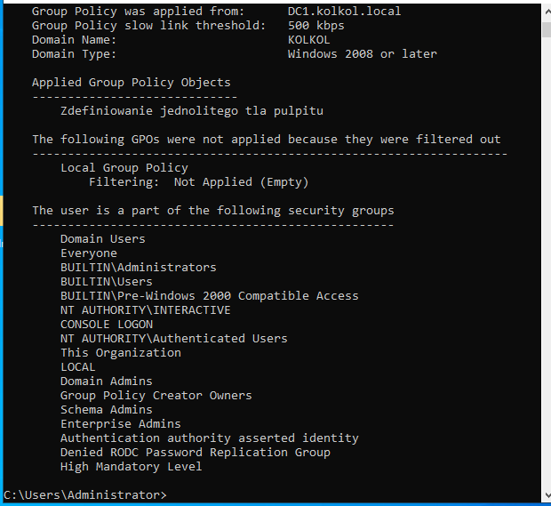
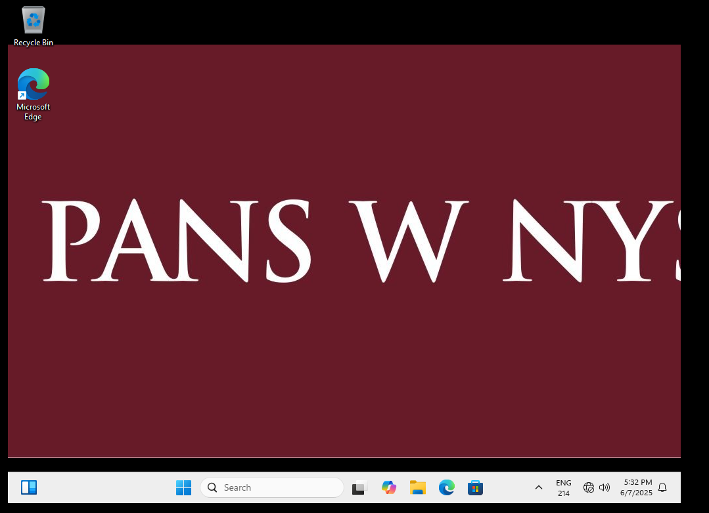

# Active Directory & Windows Server Infrastructure 🖥️

**Educational infrastructure deployment for centralized network management**
This project involves the comprehensive setup and configuration of a Windows Server environment. It solves the problem of decentralized user and network administration by implementing an Active Directory domain (`kolkol.local`).

## 🛠️ Technologies
* Windows Server
* Active Directory Domain Services (AD DS)
* Domain Name System (DNS)
* Dynamic Host Configuration Protocol (DHCP)
* Internet Information Services (IIS)
* Group Policy Management (GPO)

## ✨ Features
* Centralized identity management through Active Directory.
* Automated client IP addressing via DHCP.
* Internal hostname resolution handled by DNS.
* Centralized configuration enforcement using GPOs.
* Internal web application hosting using IIS.

## ⚙️ The Process
The deployment followed a structured approach:
1. **Domain Setup:** Promoting the server to a Domain Controller for `kolkol.local`.
2. **Network Services:** Configuring DHCP and DNS for seamless connectivity.
3. **Identity Management:** Organizing users into OUs (Organizational Units).
4. **Policy Enforcement:** Using GPOs to standardize desktop environments.
5. **Web Services:** Deploying an internal site via IIS.

## 📊 Proof of Concept / Testing

### 1. Domain Controller Promotion

**Action:** Initializing the Active Directory Domain Services configuration wizard. I selected the "Add a new forest" option and set the root domain name to `kolkol.local` to establish the core identity provider for the network.

### 2. DHCP Scope & Network Services

**Action:** Configuring the IP address range for the network scope. I defined a range from `10.1.1.1` to `10.1.1.254` with a `/24` subnet mask to ensure all client devices receive an IP address automatically.

**Action:** Assigning the DNS server IP (`10.1.1.128`) within the DHCP Scope Wizard. This step ensures that every client receiving an IP address also knows where to send DNS queries for domain resolution.

**Action:** Testing name resolution using `nslookup`. I verified that both the FQDN (`dc1.kolkol.local`) and the alias (`dc.kolkol.local`) correctly point to the server's static IP address, confirming the DNS service is healthy.

### 3. User & OU Organization

**Action:** Using *Active Directory Users and Computers* to create a new user object. I added "Jan Kadrowy" to the `Dzial Kadr` Organizational Unit (OU), which allows for granular management and department-specific policies.

### 4. Group Policy Application

**Action:** Running `gpresult /r` from an administrative command prompt. The output confirms that the "Zdefiniowanie jednolitego tla pulpitu" (Unified Desktop Background) policy is successfully applied to the current session.

**Action:** Final verification on the client side. The corporate wallpaper (PANS W NYSIE) is successfully forced by the GPO, demonstrating centralized control over the user environment.

### 5. Web Server Functionality

**Action:** Testing the IIS Web Server role by accessing `www.kolkol.local` in a browser. The successful loading of the test page confirms that the web server is running and the DNS record for the "www" prefix is working correctly.

## 💡 What I Learned
* Deploying and managing a Windows Server Domain Controller.
* Integrating DNS and DHCP for automated network management.
* Implementing security and environment standards via Group Policy.

## 🚀 What can be improved
* Implementation of a secondary Domain Controller for redundancy.
* Scripting user creation using PowerShell for better scalability.
* Enabling HTTPS on the IIS server using a local Certificate Authority.

## How to run the Project
1. Set up a Windows Server VM with a static IP (`10.1.1.128`).
2. Install AD DS, DNS, DHCP, and IIS roles via Server Manager.
3. Promote the server to a DC for `kolkol.local`.
4. Configure the DHCP scope as shown in the screenshots.
5. Join a client machine to the domain and verify policy application.
